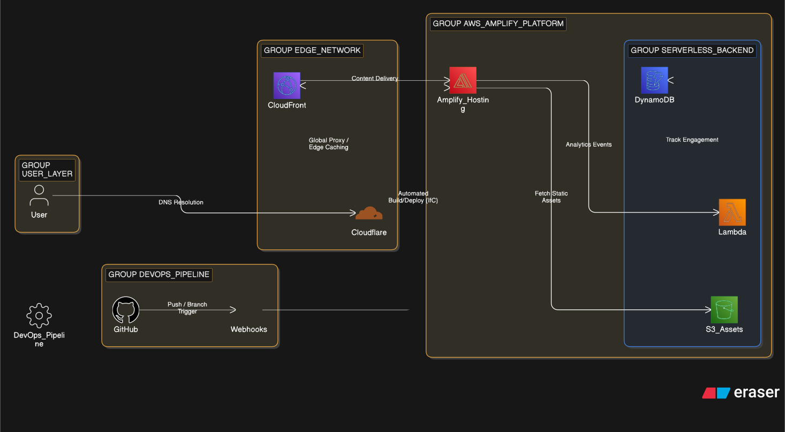

# 🌐 Cloud-Native Engineering Portfolio

   

A self-deploying, high-availability professional platform engineered with serverless primitives. This site serves as a live demonstration of **Amplify Gen 2** capabilities, automated infrastructure management, and global content delivery.

[View Live Portfolio](https://gabehouse.dev/)

---

## 🏗️ System Architecture

- **Hosting & CI/CD:** **AWS Amplify Gen 2** managing the full build-test-deploy lifecycle via GitHub Webhooks with automated environment branching.
- **Compute & Data:** Serverless architecture utilizing **AWS Lambda** for background compute and **Amazon DynamoDB** for engagement analytics.
- **Edge Networking:** A multi-vendor strategy leveraging **Cloudflare** for DNS resolution and **Amazon CloudFront** for global content delivery and SSL/TLS termination.

---

## 🛠️ Cloud Highlights

- **Automated CI/CD Pipeline:** Orchestrated a seamless deployment flow where GitHub pushes trigger isolated environment builds, ensuring production stability through **Amplify Environment Branching**.
- **Infrastructure-from-Code (IfC):** Leveraged **Amplify Gen 2** to define 100% of the backend (Data & Auth) using **TypeScript**, enabling type-safe infrastructure management and schema validation.
- **Serverless Analytics Engine:** Engineered a visitor-tracking backend using **DynamoDB** and **Lambda**, decoupling data persistence from the frontend to maintain zero-management overhead.
- **Hybrid Edge Strategy:** Integrated **Cloudflare DNS** with AWS-backed infrastructure to manage apex domain routing and optimize global resolution latency.
- **Scalable Asset Management:** Utilized **Amazon S3** and **CloudFront edge locations** to minimize Time to First Byte (TTFB) and ensure high-availability delivery of frontend assets.
- **Environment Parity:** Maintained 1:1 parity between feature previews and production, ensuring consistent configuration of IAM policies and backend resources across the organization workspace.

<p align="center">
  <a href="../cloud-portfolio/public/assets/diagram-cloud-portfolio-architecture.svg" target="_blank">
    
  </a>
  <br>
  <em>(Click diagram to view full resolution)</em>
</p>

---

## 📂 Project Structure

```text
cloud-portfolio/
├── amplify/                # IfC Backend (Data Schema & Auth)
├── public/                 # Static Assets (Logos & Diagrams)
│   └── assets/             # Shared project architecture SVGs
├── src/                    # React Component Library & Portfolio Logic
├── amplify.yml             # Build Settings & Build-Spec
└── vite.config.js          # Optimized Frontend Tooling
```

---

## 💻 Local Development

1. **Setup:**

Bash

```bash
npm install
```

2. **Cloud Sandbox:**

Bash

```bash
npx ampx sandbox
```

3. **Frontend Preview:**

Bash

```bash
npm run dev
```

## 🔒 Security & Performance

- **SSL/TLS Encryption:** All traffic is strictly served over HTTPS with automated renewal via **AWS Certificate Manager (ACM)**, ensuring continuous encryption without manual intervention.
- **Identity Isolation:** Administrative and analytics views are protected via **Amplify Auth (Cognito)**, utilizing secure JWT-based sessions to ensure public users cannot access sensitive engagement metrics.
- **Edge Caching:** Static assets are cached globally at **CloudFront edge locations**, significantly reducing latency and improving **Lighthouse performance scores** by minimizing the distance between the user and the content.
