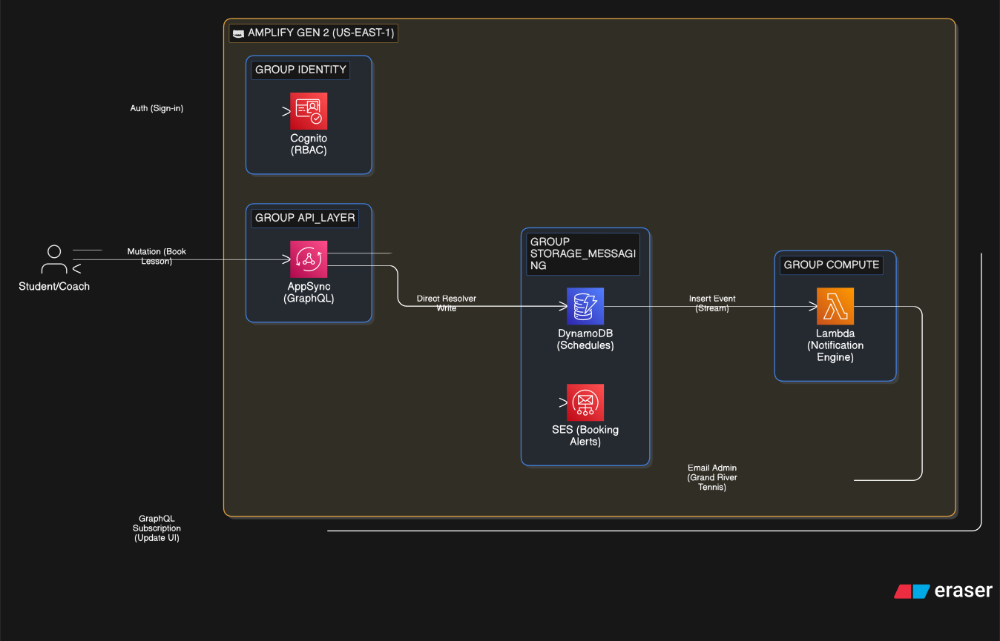

# 🎾 Grand River Tennis Lessons

    

A production-grade booking platform designed for high-availability tennis instruction scheduling. This project utilizes an **Event-Driven Serverless** architecture to decouple core transactions from notification logic, ensuring a seamless user experience during peak registration windows.

[Live Demo](https://master.dkskd07qtjixa.amplifyapp.com/)

---

## 🏗 System Architecture

<p align="center">
  <a href="../cloud-portfolio/public/assets/diagram-tennis-booking.svg" target="_blank">
    
  </a>
  <br>
  <em>(Click to view high-resolution event-driven pipeline)</em>
</p>

### **Event-Driven Booking Pipeline**

The backend utilizes **Amplify Gen 2** with a focus on decoupling:

- **Core Transaction:** Users book lessons via **AppSync (GraphQL)**, which writes directly to **DynamoDB**.
- **Asynchronous Execution:** **DynamoDB Streams** detect new records and trigger **Lambda** functions.
- **Notification Engine:** The triggered Lambdas handle high-latency tasks like **Amazon SES** email alerts, ensuring the frontend UI remains responsive and unblocked.

---

## 📂 Project Structure

```text
tennis-site/
├── amplify/                # Infrastructure-from-Code (Backend Definition)
│   ├── auth/               # Cognito & Social OIDC Federation
│   ├── data/               # DynamoDB Schema & AppSync Resolvers
│   └── functions/          # Stream-triggered Notification Logic
├── src/                    # Frontend React Application
├── amplify.yml             # Build & Deployment Configuration
├── package.json            # TypeScript & Amplify Dependencies
└── vite.config.ts          # Frontend Build Tooling
```

---

## 🛠️ Cloud Highlights

- **Infrastructure-from-Code (IfC):** 100% of the backend resources (Auth, Data, Storage) are defined using **TypeScript**. This allows for type-safe infrastructure management, schema validation at compile-time, and rapid iteration cycles.
- **Secure Identity Federation:** Engineered **Social OIDC Federation** via **AWS Cognito**, allowing users to authenticate via Google/Social providers while maintaining secure, short-lived sessions without managing sensitive credential data.
- **RBAC (Role-Based Access Control):** Implemented strict authorization rules at the API level to isolate administrative dashboard access from student booking views, ensuring data privacy and operational security.
- **Automated CI/CD:** Integrated with **AWS Amplify's Git-based deployment engine**, providing isolated branch environments and automated full-stack provisioning on every push to `master`.

---

## 💻 Local Development

1. **Clone & Install:**

   Bash

   ```bash
   git clone <repo-url>
   cd services/tennis-site
   npm install
   ```

2. **Deploy Personal Sandbox:**
   Launch a personal cloud sandbox to test backend changes in real-time without affecting production:

   Bash

   ```bash
   npx ampx sandbox
   ```

3. Start Local Frontend:

   Bash

   ```bash
   npm run dev
   ```

   ***

## 🔒 Security & Performance

- **Decoupled Workloads:** By utilizing **DynamoDB Streams**, the system architecture effectively prevents "Long-Running Request" anti-patterns. This approach significantly improves **API Gateway timeouts** and reduces user-perceived latency by offloading side effects (like notifications) to background processes.
- **Zero-Trust Client Access:** Frontend data access is strictly governed via **IAM and OIDC-backed JWTs**. This ensures a robust security posture where users are cryptographically restricted to reading or writing only their own specific booking records.
- **Scalable Notifications:** The event-driven nature of the notification engine ensures that even during high-traffic registration windows, the core booking flow remains performant and isolated from downstream service delays.
