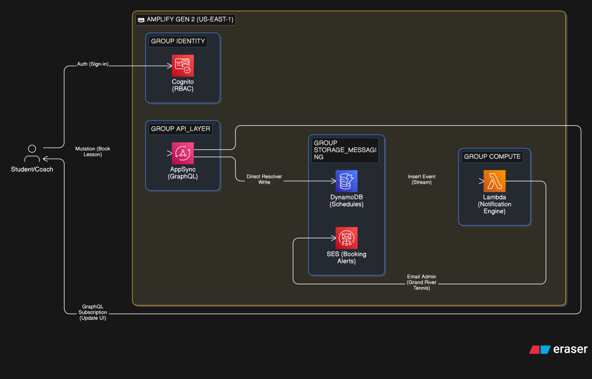

# Grand River Tennis Lessons

   

Lesson booking site for a tennis coaching side business: a weekly calendar where signed-in users book and cancel one-hour slots, and the coach gets an email for each change.

[Live site](https://grandrivertennis.ca)

---

## Architecture

<p align="center">
  <a href="../cloud-portfolio/public/assets/diagram-tennis-booking-architecture.svg" target="_blank">
    
  </a>
</p>

- **Booking:** The browser calls the `bookSlot` / `cancelBooking` GraphQL mutations on AppSync. Both are handled by one Lambda, which is the only writer of the booking tables.
- **No double booking:** A booking writes two rows in a single DynamoDB transaction (`TransactWriteItems`), each with `attribute_not_exists` as a condition. If two people book the same slot at once, exactly one transaction succeeds and the other gets "that slot was just booked".
- **Notifications:** The `Booking` table's DynamoDB Stream triggers a second Lambda that sends the email through SES. The stream is filtered to `INSERT` and `REMOVE` events, failed records are retried 3 times, and anything still failing lands in an SQS dead-letter queue. Every booking change sends an email, whether it came from the UI, an admin, or the API directly.
- **Schedule:** Open hours are defined in `amplify/shared/schedule.ts`, which both the browser (to draw the grid) and the booking Lambda (to reject invalid or past slots) import. There is no stored list of open slots.

## Data model and access

| Model | Contents | Who can read | Who can write |
| --- | --- | --- | --- |
| `Slot` | date, time | Everyone (public API key) | Booking Lambda only |
| `Booking` | date, time, owner, name, email | The booker and the `Admins` Cognito group | Booking Lambda only |
| `WaitlistEntry` | name, email | The entry's owner and `Admins` | The owner; `Admins` can delete |

`Slot` and `Booking` share the key `(dateSlot, timeSlot)`. Splitting them keeps the public calendar free of personal information without field-level rules. Cancelling checks that the caller owns the booking or is in `Admins`, using the Cognito `sub` and groups from the request rather than anything the browser sends.

## Project structure

```text
tennis-site/
├── amplify/
│   ├── auth/            # Cognito: email + Google sign-in, Admins group
│   ├── data/            # GraphQL schema, authorization rules, custom mutations
│   ├── functions/
│   │   ├── booking/        # bookSlot / cancelBooking resolver (conditional writes)
│   │   └── booking-email/  # DynamoDB Stream consumer that sends SES email
│   ├── shared/          # Schedule rules used by both frontend and backend
│   └── backend.ts       # IAM grants, stream mapping, dead-letter queue
├── src/                 # React frontend
└── amplify.yml          # Amplify Hosting build (frontend + backend per branch)
```

## Local development

```bash
pnpm install
npx ampx sandbox   # deploys a personal backend and writes amplify_outputs.json
pnpm dev
```

To make yourself an admin after deploying, add your Cognito user to the `Admins` group:

```bash
aws cognito-idp admin-add-user-to-group --user-pool-id <pool-id> --username <username> --group-name Admins
```
