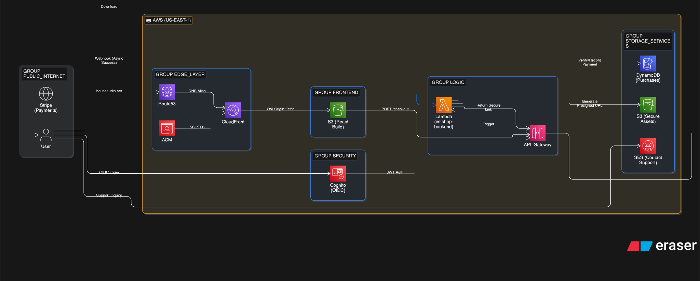

# 🎹 House Audio (Full-Stack Engine)

    

A modern, high-performance template for selling digital assets (VSTs, samples, or software). Powered by a **React + Vite** frontend and a **fully serverless AWS architecture** managed through an enterprise-grade Multi-Account Terraform structure.

[Live Demo](https://houseaudio.net/)

## 🏗️ System Architecture

- **Fulfillment Engine:** Event-driven pipeline utilizing **Stripe Webhooks**, **DynamoDB**, and **AWS Lambda** for real-time order processing.
- **Identity & Security:** **Cognito-backed OIDC** federation providing secure, token-based access to digital assets.
- **Infrastructure-as-Code:** 100% managed via **Terraform** to ensure modular, repeatable, and version-controlled cloud provisioning.

---

## 🛠️ Cloud Highlights

- **Automated Fulfillment Pipeline:** Engineered a serverless "Purchase-to-Download" workflow where Stripe events trigger Lambda-validated **S3 Presigned URLs**, ensuring secure and temporary asset delivery to customers.
- **Identity Federation:** Orchestrated **Amazon Cognito** with **OIDC (Google Social Login)** to secure downstream API access, implementing a modern passwordless authentication flow.
- **Keyless CI/CD:** Integrated **GitHub Actions via OIDC** for credential-less deployments to AWS, adhering to **Zero-Trust** security principles by eliminating long-lived IAM secrets.
- **IaC Automation:** Developed modular **Terraform** templates to manage the full serverless stack, including automated **ACM certificate validation** and CloudFront distribution logic.
- **Global Traffic Routing:** Architected the domain infrastructure using **Amazon Route 53**, leveraging high-availability DNS routing to provide low-latency entry points for the global distribution network.
- **Containerized Parity:** Leveraged **Docker Devcontainers** to maintain 1:1 environment parity between local development and the AWS Lambda production runtime.

<p align="center">
  <a href="../cloud-portfolio/public/assets/diagram-vstshop.svg" target="_blank">
    
  </a>
  <br>
  <em>(Click diagram to view full resolution)</em>
</p>

---

## 🛠️ Tech Stack & Dependencies

### **Enterprise Infrastructure (Terraform)**

- **Multi-Account Orchestration:** Utilizes **AWS Organizations** to separate `Management`, `Dev`, and `Prod` workloads.
- **Automated Lifecycle:** **GitHub Actions** CI/CD utilizing **OIDC** for keyless, secure deployments.
- **Lambda Layers:** Automated Python dependency packaging for high-performance execution.
- **Least-Privilege IAM:** Granular, resource-specific roles to minimize the security attack surface.

### **Frontend & DX**

- **Vite:** For near-instant Hot Module Replacement (HMR) and optimized builds.
- **AWS Amplify SDK:** Seamless **Cognito Auth** and session management integration.
- **Hard-Link Syncing:** `setup_config.sh` ensures a **Single Source of Truth** by syncing `config.yaml` across frontend and backend runtimes.

---

## 📂 Project Structure

```text
.
├── .github/workflows/      # CI/CD Pipeline (GitHub Actions)
├── config.yaml             # Single source of truth for VST catalog & constants
├── infra/                  # Enterprise-grade Multi-Account Terraform
│   ├── management/         # Identity (OIDC/GitHub Actions) & Organizations
│   ├── modules/            # Reusable business logic (Auth, API, Storage, DB)
│   └── workloads/          # Environment-level instances (Dev vs. Production)
├── services/
│   └── vstshop-frontend/   # React + Vite application source code
└── validate-all.sh         # Global security, linting, and integrity checks
```

---

## 🔒 Security & Performance

- **Protected Downloads:** Assets are strictly private. The `/download` API performs a **DynamoDB Entitlement Check** before issuing a **15-minute S3 Presigned URL**.
- **Signature Verification:** All Stripe fulfillment events are validated via **HmacSHA256 signatures** to prevent spoofing.
- **State Persistence:** Infrastructure state is managed via **Remote S3 Backends** with **DynamoDB State Locking** to prevent concurrent deployment conflicts.
- **Keyless Auth:** Zero permanent AWS keys stored in GitHub; all deployment runners utilize short-lived session tokens via **OIDC**.

---

## ⚡ Deployment Workflow

### **1. Automated CI/CD (Recommended)**

Pushing to the `master` branch triggers a **GitHub Actions** workflow that:

1. **Validates** Terraform formatting and security policies.
2. **Synchronizes** the local VST catalog with the **Stripe Dashboard**.
3. **Deploys** the serverless stack and invalidates the **CloudFront** edge cache.

### **2. Manual Handshake (Initial Setup)**

For the first deployment, a "handshake" is required to link **Stripe Webhooks**:

1. Run `terraform apply` in the desired workload folder (e.g., `infra/workloads/dev`).
2. Retrieve the `api_url` from the Terraform outputs.
3. Configure a **Stripe Webhook** in your dashboard pointing to `${api_url}/webhook`.
4. Update the `stripe_webhook_secret` in your `secrets.auto.tfvars` and re-apply.
