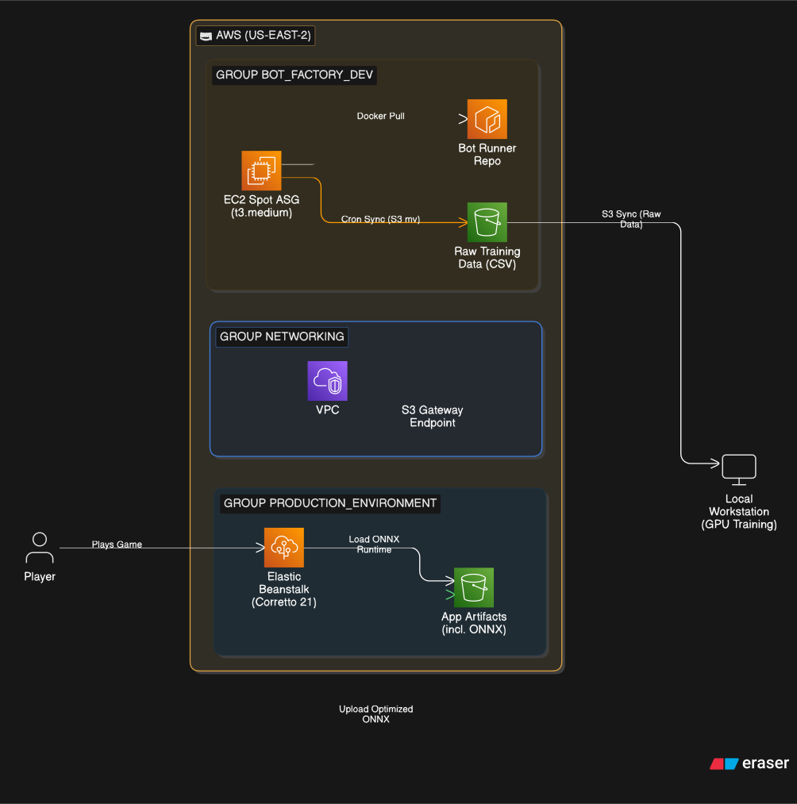
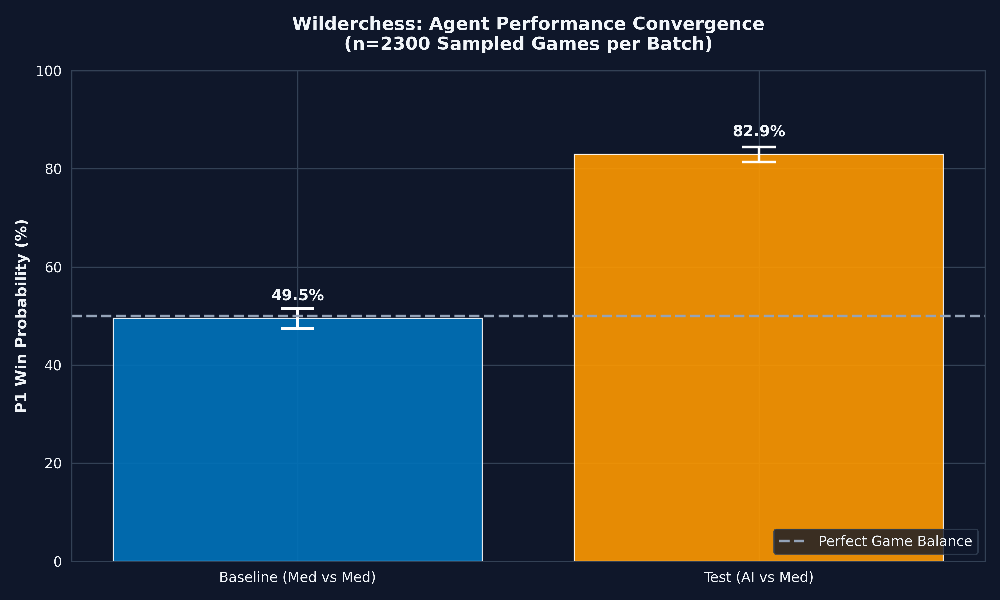

# Wilderchess: ML-Driven Strategy Engine

   

A high-concurrency game engine and infrastructure platform designed for real-time PvP and large-scale Reinforcement Learning data generation.

[Live Demo](http://wilderchess.eba-swezjps7.us-east-2.elasticbeanstalk.com/)

## 🏗 System Architecture

<p align="center">
  <a href="../cloud-portfolio/public/assets/diagram-wilderchess.svg" target="_blank">
    
  </a>
  <br>
  <em>(Click to view high-resolution system architecture)</em>
</p>

- **Backend:** Java 21 (Amazon Corretto) with high-availability WebSockets.
- **Infrastructure:** Modular Terraform managing AWS Elastic Beanstalk, ECR, and Spot Instance Fleets.
- **Inference:** Integrated ONNX Runtime for sub-1ms model execution.

## 📊 Performance & Insights

|               Inference Latency                |               Strategy Heatmap               |
| :--------------------------------------------: | :------------------------------------------: |
|  |  |

---

---

## 📂 Project Structure

```text
wilderchess/https://github.com/
├── .github/workflows/   # CI/CD Pipeline (GitHub Actions)
├── src/wilderchess/     # Core Library (Python)
├── src/main/java/       # Game Engine (Java)
├── ops/                 # Shell Deployment & CI/CD Scripts
├── scripts/             # ML Utility & Data Analysis Scripts
├── models/              # ONNX Binaries & Scalers
├── docs/images/         # Performance Charts & Heatmaps
├── pom.xml              # Maven Configuration
└── pyproject.toml       # UV / Python Configuration
```

---

## 💻 Local Development (DX)

This project utilizes a high-performance **VS Code Dev Container** environment.

1. **Environment:** Open the project in VS Code and select "Reopen in Container".
2. **Package Management:** Run `uv sync` to initialize the Python/ML environment via hard-links (optimized for speed and disk space).
3. **Execution:** Use the operations script to launch the local engine:

Bash

```bash
./ops/run.sh
```

## 🚀 Deployment & Orchestration

Wilderchess utilizes a hybrid deployment model: **Automated CI/CD** for the web application and **Manual Orchestration** for large-scale ML data generation.

## 🤖 Production Environment (Elastic Beanstalk)

The primary game engine is deployed via a **Push-to-Deploy** model.

**Primary Workflow:** Merging or pushing to the `master branch` triggers the **GitHub Actions** pipeline. This builds the Java artifact, packages it for Elastic Beanstalk, and executes `terraform apply` using **OIDC** for secure, keyless authentication.

**Manual Fallback:** For emergency deployments or specific version rollbacks, use the provided utility script:

Bash

```bash
# Manual override (requires prod profile)
export AWS_PROFILE=prod
./ops/deploy_eb.sh
```

## 🧪 Simulation & ML Environment (Spot Fleets)

Data generation for Reinforcement Learning is managed manually to provide granular control over cost and scale.

1. Authenticate via AWS SSO:

Bash

```bash
aws sso login --profile dev
```

2. **Update Simulation Artifacts:**
   Push the latest Python bot logic or container image to **Amazon ECR**:

Bash

```bash
./ops/push_bot.sh
```

3. **Infrastructure Scaling:**
   Modify `main.tf` to configure simulation parameters before provisioning:

**Scale Capacity:** Adjust `desired_bots` (e.g., 1 for testing, 100+ for high-volume data).

**Logic Switches:** \* Set `run_bot_vs_bot` to `true` for autonomous simulations.

Set `bot_is_ai` to `false` for rule-based heuristics or `true` for RL training.

4. **Provision Infrastructure:**

Bash

```bash
terraform plan
terraform apply
```

## 🛠 Project Highlights

**Cost Optimization:** Leveraged **AWS Spot Instances** via ASG Mixed Instance Policies, reducing data generation costs by **~80%**.

**Zero-Trust Identity:** Utilizes **GitHub Actions via OIDC** for secure, keyless cloud deployments, eliminating the need for long-lived IAM secrets.

**Continuous Infrastructure:** 100% of the cloud stack is managed via **Terraform**, with the production lifecycle fully integrated into GitHub for repeatable, hands-off deployments.
